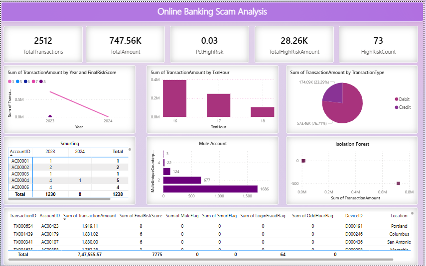

# Online Banking Scam Analysis

**Repository:** Online Banking Scam Analysis — Python + Power Query → Power BI&#x20;

> This repository demonstrates fraud detection on online banking transactions. It uses a **single Python file** for ETL + feature engineering + anomaly detection + risk scoring, producing a BI-ready CSV for Power BI dashboards.

---

## 🔎 Project Overview

This project processes transaction logs to detect fraud patterns:

* **Smurfing** (many small transfers)
* **Money mule activity** (many unique counterparties)
* **Account takeover** (new device/IP + login anomalies)
* **Large suspicious transfers**
* **Odd hour activity**
* **Login fraud**
* **ML anomaly detection** (Isolation Forest)

The output is a fraud-analytics-ready dataset, visualized via **Power BI** or **Tableau**.

---

## ✅ Columns Generated

| Column                    | Meaning                             |
| ------------------------- | ----------------------------------- |
| TransactionID             | Unique transaction identifier       |
| AccountID                 | Account identifier                  |
| TransactionAmount         | Amount of transaction               |
| TransactionDate           | Datetime of transaction             |
| TransactionType           | e.g. transfer, withdrawal, purchase |
| Location                  | City/country (if available)         |
| DeviceID                  | Device identifier (hashed)          |
| IP Address                | IP address (anonymized/hashed)      |
| MerchantID                | Counterparty / merchant id          |
| Channel                   | Mobile, web, ATM, etc.              |
| CustomerAge               | Customer age                        |
| CustomerOccupation        | Occupation                          |
| TransactionDuration       | Gap from previous transaction       |
| LoginAttempts             | Count of login attempts before txn  |
| AccountBalance            | Balance before transaction          |
| PreviousTransactionDate   | Last transaction datetime           |
| TxnHour                   | Transaction hour (0–23)             |
| IsSmallTxn                | Binary flag (1 = small txn)         |
| SmurfCount24h             | # small txns in last 24h            |
| SmurfSum24h               | Sum of those txns                   |
| SmurfFlag                 | Smurfing detected                   |
| MuleUniqueCounterparty30d | # unique counterparties in 30 days  |
| MuleFlag                  | Mule suspicion                      |
| IsNewDeviceFlag           | Transaction from new device         |
| IsNewIPFlag               | Transaction from new IP             |
| AccountTakeoverFlag       | Takeover suspicion                  |
| LargeByQuantile           | Large txn by quantile threshold     |
| LargeByAvgMult            | Large txn compared to avg           |
| LargeTransferFlag         | Large transfer detected             |
| OddHourFlag               | Odd-hour transaction (00–05)        |
| LoginFraudFlag            | Login fraud detected                |
| IForestFlag               | Isolation Forest anomaly flag       |
| IForestScore              | Isolation Forest anomaly score      |
| FinalRiskScore            | Composite risk score                |
| RuleRiskScore             | Rule-based risk score               |

---

## 🧭 Key Detection Thresholds

* Smurfing: ≤ 200 per txn, ≥ 5 txns, sum ≥ 500 within 24h
* Money mule: ≥ 10 unique counterparties in 30d
* Account takeover: new device/IP (+ failed logins if available)
* Large suspicious transfer: > 99.9th percentile OR > 10× avg
* Odd hours: 00:00–05:00
* Login fraud: LoginAttempts > 3
* Isolation Forest: contamination 0.02 (2%)

---

## 🧰 How to Run (Single Python File)

```bash
# clone repository
git clone https://github.com/Akkshayalakshmi/online-banking-scam-analysis.git
cd online-banking-scam-analysis

# install dependencies
pip install -r requirements.txt

# run the pipeline (single Python file)
python fraud_pipeline.py --input data/Online Banking Scam.csv --output data/processed_transactions.csv
```

Example snippet from `fraud_pipeline.py`:

```python
import pandas as pd
from sklearn.ensemble import IsolationForest

# Load data
transactions = pd.read_csv(input_file, parse_dates=['TransactionDate'])

# Feature engineering example
transactions['TxnHour'] = transactions['TransactionDate'].dt.hour
transactions['OddHourFlag'] = transactions['TxnHour'].between(0, 5).astype(int)

# Smurfing rule
transactions['IsSmallTxn'] = (transactions['TransactionAmount'] <= 200).astype(int)
transactions['SmurfCount24h'] = (
    transactions.groupby('AccountID')['IsSmallTxn']
    .rolling('24h', on='TransactionDate').sum().reset_index(level=0, drop=True)
)
transactions['SmurfFlag'] = ((transactions['SmurfCount24h'] >= 5) & (transactions['IsSmallTxn'] == 1)).astype(int)

# Money mule rule
transactions['MuleUniqueCounterparty30d'] = (
    transactions.groupby('AccountID')['MerchantID']
    .rolling('30d', on='TransactionDate').apply(lambda x: x.nunique(), raw=False).reset_index(level=0, drop=True)
)
transactions['MuleFlag'] = (transactions['MuleUniqueCounterparty30d'] >= 10).astype(int)

# Large suspicious transfer rule
threshold = transactions['TransactionAmount'].quantile(0.999)
transactions['LargeTransferFlag'] = (transactions['TransactionAmount'] > threshold).astype(int)

# Login fraud rule
transactions['LoginFraudFlag'] = (transactions['LoginAttempts'] > 3).astype(int)

# Isolation Forest anomaly detection
model = IsolationForest(contamination=0.02, random_state=42)
transactions['IForestFlag'] = model.fit_predict(transactions[['TransactionAmount']])
transactions['IForestScore'] = model.decision_function(transactions[['TransactionAmount']])
```

---

## 📊 Dashboards

You can load the processed CSV into **Power BI**:

* KPI cards: High Risk Txns, % Anomalies, Large Transfers
* Donut/Pie: RiskCategory (Low, Medium, High)
* Line chart: Transactions over time (highlight anomalies)
* Fraud Type Pages: Smurfing, Mule Accounts, Takeovers, Odd Hours, Login Fraud
* Investigation Table: Drill-through by AccountID or TransactionID

---

## ✍️ DAX Examples

```dax
HighRiskCount = CALCULATE(COUNTROWS(Transactions), Transactions[FinalRiskScore] >= 4)
PctHighRisk = DIVIDE([HighRiskCount], COUNTROWS(Transactions), 0)
SmurfingCount = CALCULATE(COUNTROWS(Transactions), Transactions[SmurfFlag] = 1)
MuleAccounts = CALCULATE(DISTINCTCOUNT(Transactions[AccountID]), Transactions[MuleFlag] = 1)
AccountTakeovers = CALCULATE(COUNTROWS(Transactions), Transactions[AccountTakeoverFlag] = 1)
```

---

## 🔧 Requirements

* Python 3.9+

* Dependencies: `pandas`, `numpy`

**🗂 Repository Structure**

```
/ (root)
├─ data/                   # raw & processed CSVs
├─ fraud_pipeline.py       # single Python ETL + risk scoring script
├─ requirements.txt
└─ README.md
```
---
## 📊 Dashboard Preview  
  
|:-------------------------------------:|
---

```mermaid
flowchart TD
    A[/Raw Transactions CSV/] --> B[fraud_pipeline.py]
    B --> C[Feature Engineering]
    C --> D{Rule-based Detection}
    C --> E[Isolation Forest ML]
    D --> F[Final Risk Score]
    E --> F[Final Risk Score]
    F --> G[/Processed CSV/]
    G --> H[/Power BI / Tableau Dashboards/]